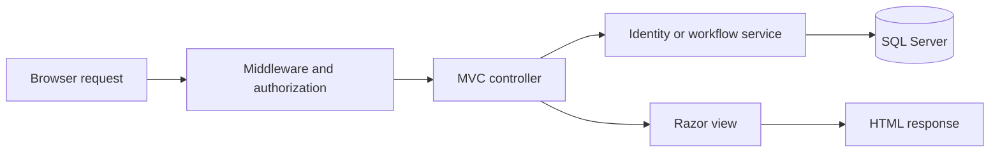
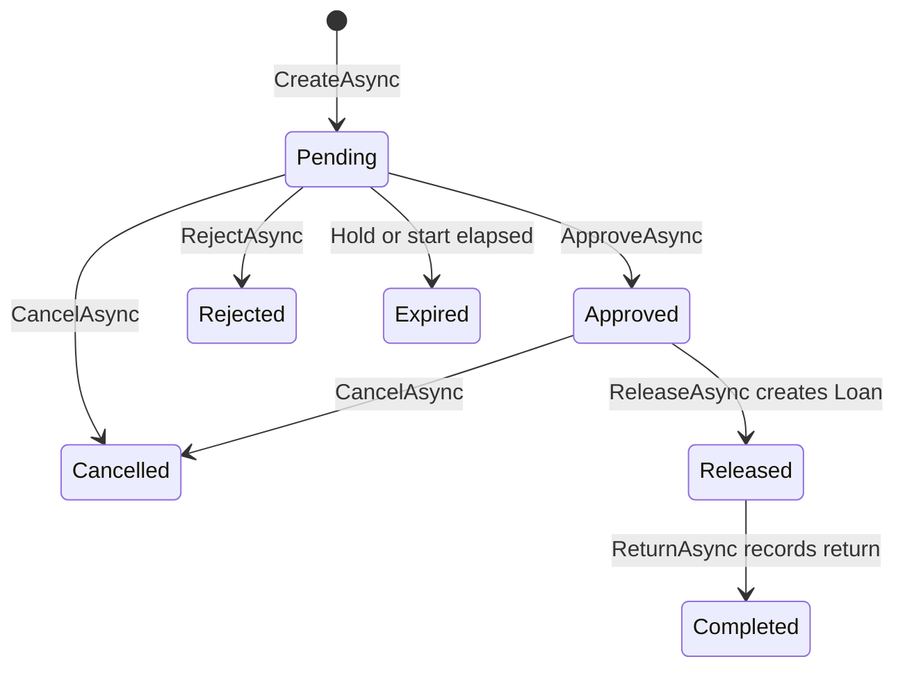

# CampusGear codebase cheatsheet

This guide describes the code currently in this repository. Start with it when tracing a feature, fixing a bug, or onboarding another developer. For installation and email setup, see the [README](../README.md). Commands below run from the repository root, the directory containing that README.

## Contents

- [System overview](#system-overview)
- [Folder map](#folder-map)
- [Startup and request handling](#startup-and-request-handling)
- [Controllers, routes, and views](#controllers-routes-and-views)
- [Database and models](#database-and-models)
- [Account and email flows](#account-and-email-flows)
- [Reservation and loan lifecycle](#reservation-and-loan-lifecycle)
- [Concurrency and audit history](#concurrency-and-audit-history)
- [Frontend and Figma reference](#frontend-and-figma-reference)
- [Configuration and local startup](#configuration-and-local-startup)
- [Where to make common changes](#where-to-make-common-changes)
- [Tests and troubleshooting](#tests-and-troubleshooting)

## System overview

CampusGear manages equipment borrowing for a campus. Borrowers request equipment, custodians approve and hand it out, and administrators manage equipment and access. SQL Server stores accounts, bookings, loans, maintenance, email challenges, and audit events.

| Component | Implementation | Purpose |
| --- | --- | --- |
| Web server | .NET 8 / ASP.NET Core | Receives requests, runs authentication and authorization, and returns pages |
| Live pages | MVC controllers and Razor `.cshtml` views | Server-rendered forms, tables, dashboards, and feedback |
| Database access | Entity Framework Core 8 / SQL Server | Queries, relationships, migrations, and transactions |
| Accounts | ASP.NET Core Identity | Passwords, roles, email confirmation, lockout, cookies, and security stamps |
| Email codes | `EmailChallengeService` + `IEmailSender` | Signup verification, administrator sign-in, and password recovery |
| Reservation rules | `IReservationService` / `ReservationService` | Booking validation and reservation/loan state changes |
| Scheduled expiry | `ReservationExpiryWorker` | Marks elapsed pending reservations as expired |
| Browser behavior | CSS and plain JavaScript | Responsive navigation, form summaries, and visual states |
| Design reference | Razor Pages at `/demo/...` | Saved Figma screens and states for comparison |

There is no separate React application running the live site. The saved JSX/Tailwind files are design source snapshots. The live application builds with .NET; Node is used by the offline Figma tooling.

The three roles are `Borrower`, `Custodian`, and `Administrator`. Route authorization is enforced on the server. A visible navigation link does not grant permission. Self-registration assigns Borrower; staff roles are assigned through administrator management.

## Folder map

```text
repository root/
├── README.md                         Setup, quick file map, commands
├── docs/CODEBASE_CHEATSHEET.md        This developer guide
├── PRODUCT.md                        Product purpose and UI principles
├── DESIGN.md                         Figma visual rules and tokens
├── .config/dotnet-tools.json          Local dotnet-ef tool version
├── CampusGear/
│   ├── CampusGear.sln                 Visual Studio solution
│   ├── CampusGear.WebApp/             ASP.NET Core executable project
│   │   ├── CampusGear.WebApp.csproj    Web SDK, User Secrets ID, project references
│   │   ├── Program.cs                 Startup, services, middleware, routes
│   │   ├── Controllers/               Live HTTP endpoints and screen models
│   │   ├── Configuration/             Web-host configuration loaders
│   │   ├── Filters/                   Account antiforgery recovery
│   │   ├── Models/                    Web/UI mappings only
│   │   ├── Views/                     Live Razor views and shared layouts
│   │   ├── Pages/                     Root redirect, errors, reference demo
│   │   │   └── Figma/Frames/          Generated reference Razor partials
│   │   ├── Properties/launchSettings.json  Local launch URLs and environment
│   │   ├── appsettings*.json          Committed non-secret settings
│   │   └── wwwroot/                   Public CSS, JS, images, fonts, libraries
│   ├── CampusGear.Services/           Business processing layer
│   │   ├── Interfaces/                Email/reservation contracts
│   │   └── Services/                  Workflow implementations
│   │       └── Reservations/          Booking/loan rules and expiry worker
│   ├── CampusGear.Data/               DbContext, entities, initialization, migrations
│   │   ├── Models/                    Persisted domain/Identity entities
│   │   └── Migrations/                EF Core schema history
│   ├── CampusGear.Resources/          Shared constants and static resources
│   │   └── Constants/                 Cross-layer domain enums
│   └── CampusGear.IntegrationTests/   SQL and email/configuration tests
├── scripts/                          Gmail setup, local smoke test, verification notes
└── figma-reference/                  Saved frames, manifests, source snapshots, tools
```

This matches the teacher base-code separation: WebApp owns HTTP/UI, Services owns processing, Data owns persistence, and Resources owns shared static vocabulary. Project dependencies point inward: WebApp references Services/Data/Resources; Services references Data/Resources; Data references Resources. IntegrationTests references all layers. Existing namespaces were kept during the move so the schema and feature code did not need a risky rewrite.

In the tables below, bare `Controllers/`, `Views/`, `Pages/`, `Configuration/`, and `wwwroot/` paths are inside `CampusGear.WebApp`; `Models/` entity paths are inside `CampusGear.Data`; service contracts and implementations are inside `CampusGear.Services`.

## Startup and request handling

[Program.cs](../CampusGear/CampusGear.WebApp/Program.cs) is the application entry point. Read it first to understand how the pieces are connected.

1. Create the web host and load Development-only email settings through `DevelopmentConfiguration.LoadProjectSecrets`.
2. Register MVC, Razor Pages, `ApplicationDbContext`, Identity, auth cookies, sessions, and the `auth-post` rate limiter.
3. Register `EmailChallengeService`, the selected `IEmailSender`, `IReservationService`, `TimeProvider`, and the expiry worker.
4. Build the application and log the email provider and safe configuration-presence flags.
5. Configure exception handling outside Development, HTTPS redirection, static files, routing, rate limiting, sessions, authentication, inactive-account handling, and authorization.
6. Map controller and Razor Page endpoints, then run `DbInitializer.InitializeAsync`.
7. Exit when `--initialize-only` was supplied; otherwise start the web server.

In Development, initialization applies migrations and seeds equipment when the equipment table is empty. Roles are ensured during initialization in all environments. Outside Development, the database schema must already be migrated. Bootstrap administrator creation uses explicit environment variables and only runs when no administrator exists.



Controllers can query the DbContext directly for listings. Reservation and loan mutations go through `ReservationService`; inventory, categories, users, and maintenance have their own controller mutation logic. There is no generic repository layer to search for.

`ApplicationDbContext`, Identity managers, email challenges, and the reservation service are scoped to a request/service scope. Email senders and `TimeProvider` are singletons. The background worker creates a fresh scope for each expiry batch rather than keeping one DbContext forever.

## Controllers, routes, and views

Routes use HTTP attributes such as `[HttpGet("borrower/reservation")]`; they are not inferred solely from controller names. `AccountController` adds the class prefix `/auth`. `{id}` below means the record ID; reservation/item IDs are generally GUIDs and Identity user IDs are strings.

| Controller file | Main GET routes | Responsibility and live view folder |
| --- | --- | --- |
| `Controllers/AccountController.cs` | `/auth/login`, `/auth/signup`, `/auth/email-verification`, `/auth/two-factor`, `/auth/password-reset-request`, `/auth/password-reset-code`, `/auth/password-reset-new`, `/auth/success`, `/auth/access-denied` | Identity, pending sessions, email challenges, and authentication feedback; `Views/Account/` |
| `Controllers/WorkspaceController.cs` | `/borrower/dashboard`, `/custodian/dashboard`, `/admin/dashboard` | Role-specific SQL-backed dashboard metrics and rows; `Views/Workspace/Dashboard.cshtml` |
| `Controllers/BorrowerController.cs` | `/borrower/reservation`, `/borrower/history`, `/borrower/calendar` | Own booking form, cancellation, filtered history, availability calendar; `Views/Borrower/` |
| `Controllers/CustodianController.cs` | `/custodian/approvals`, `/custodian/returns`, `/custodian/history`, `/custodian/calendar`, `/custodian/reservations/{id}` | Queues, details, approve/reject/release/return actions; `Views/Custodian/` |
| `Controllers/AdminReservationsController.cs` | `/admin/reservations` | Create reservations for borrowers and cancel requests through the shared service; `Views/AdminReservations/` |
| `Controllers/AdminInventoryController.cs` | `/admin/equipment` | Item search, add/edit forms, active status, condition, and inventory validation; `Views/AdminInventory/` |
| `Controllers/AdminCategoriesController.cs` | `/admin/categories` | Category listing and editing; `Views/AdminCategories/` |
| `Controllers/AdminUsersController.cs` | `/admin/users`, `/admin/borrowers`, `/admin/users/{id}/edit`, `/admin/audit` | Roles, active accounts, borrower profiles/eligibility, and audit listing; `Views/AdminUsers/` |
| `Controllers/MaintenanceController.cs` | `/admin/maintenance` | Open repair cases, update their status, close repairs; accessible to Administrator and Custodian; `Views/Maintenance/` |
| `Controllers/DevelopmentController.cs` | `/development/email` | In-memory mailbox UI; Development + loopback + selected Development sender only; `Views/Development/` |

`CustodianController` also exposes administrator queue/calendar aliases: `/admin/approvals`, `/admin/returns`, `/admin/history`, and `/admin/calendar`. It uses the same workflow implementation and shared custodian views. Custodian operations permit Custodian and Administrator; role dashboard endpoints have their specific role requirement.

### Mutation routes worth knowing

| Action | POST route | Main implementation |
| --- | --- | --- |
| Login/signup/verify/reset form | Corresponding `/auth/...` page route | `AccountController` |
| Resend signup/admin/reset code | `/auth/resend-email-verification`, `/auth/resend-two-factor`, `/auth/resend-password-reset-code` | `AccountController` → `EmailChallengeService` |
| Sign out | `/auth/logout` | Identity sign-out + flow session clear |
| Borrower request/cancel | `/borrower/reservation`, `/borrower/reservation/{id}/cancel` | `BorrowerController` → reservation service |
| Staff approve/reject/release/return | `/custodian/reservations/{id}/approve`, `/reject`, `/release`, `/return` suffixes | `CustodianController` → reservation service |
| Administrator request/cancel | `/admin/reservations`, `/admin/reservations/{id}/cancel` | `AdminReservationsController` → reservation service |
| Save equipment/category | `/admin/equipment/save`, `/admin/categories/save` | Inventory/category controller |
| Add category from inventory | `/admin/categories` | `AdminInventoryController.AddCategory` |
| Edit an account | `/admin/users/{id}/edit` | `AdminUsersController` |
| Open/update maintenance | `/admin/maintenance/open`, `/admin/maintenance/{id}/update` | `MaintenanceController` |

POST forms require antiforgery tokens. Account POSTs additionally use `auth-post`: 20 requests per minute per remote IP with no queue, returning HTTP 429 at the limit.

Many input DTOs and screen view models are declared at the bottom of their WebApp controller file. For example, `SignUpInput` lives in `AccountController.cs`; `ReservationInputModel` lives in `BorrowerController.cs`. Persisted entities live in `CampusGear.Data/Models`. Search the type name before creating another similarly named class.

## Database and models

[ApplicationDbContext.cs](../CampusGear/CampusGear.Data/ApplicationDbContext.cs) extends `IdentityDbContext<ApplicationUser>`. It defines the DbSets, relationships, indexes, SQL check constraints, string lengths, enum storage, and row versions. [CampusGear.Data/Migrations](../CampusGear/CampusGear.Data/Migrations) contains the initial schema and model snapshot.

| Model file | Database concept | Important relationship or field |
| --- | --- | --- |
| `Models/ApplicationUser.cs` | Identity account (`AspNetUsers`) | Adds full name, active flag, timestamps, optional borrower profile; passwords/roles remain Identity-managed |
| `Models/BorrowerProfile.cs` | Borrowing access | One profile per user; student number, department, contact, eligibility, notes |
| `Models/EquipmentCategory.cs` | Equipment grouping | One category has many equipment items |
| `Models/EquipmentItem.cs` | Individual physical asset | Unique asset code, optional unique serial, category, condition, active flag, maintenance hold |
| `Models/Reservation.cs` | Requested/approved booking interval | Links one borrower profile to one item; unique `RequestId`, UTC times, status, decision data |
| `Models/Loan.cs` | Physical equipment handover | At most one loan per reservation; release/due/return times and staff/condition records |
| `Models/MaintenanceCase.cs` | Repair or inspection record | Belongs to an item; may link the loan that caused it; status, description, resolution, staff |
| `Models/EmailChallenge.cs` | One-time email verification attempt | User + purpose, protected code data, lifetime, attempts, consumed/invalidated timestamps |
| `Models/AuditEvent.cs` | Recorded account/equipment operation | Actor, action, entity, outcome, before/after JSON, IP, correlation ID, timestamp |
| `CampusGear.Resources/Constants/DomainEnums.cs` | Shared state vocabulary | Reservation status, equipment condition, maintenance status, challenge purpose |

Relationship map:

```text
ApplicationUser ── 0..1 BorrowerProfile ── many Reservations
EquipmentCategory ── many EquipmentItems ── many Reservations
Reservation ── 0..1 Loan
EquipmentItem ── many MaintenanceCases ── optional Loan reference
ApplicationUser ── many EmailChallenges
AuditEvent ── optional actor ApplicationUser
```

Identity also owns its standard roles, user-role membership, claims, logins, and token tables. A role is not a property named `Role` on `ApplicationUser`.

SQL enforces unique normalized email, asset code, request ID, loan reservation ID, and profile user ID. Optional student numbers and serial numbers use filtered unique indexes. Time constraints reject invalid booking, loan, and maintenance ranges. Many relationships restrict deletion so historical records cannot silently disappear with their parent.

Mutable workflow entities use SQL `rowversion` for optimistic concurrency. This is a version token, not a date/time. Admin forms send version data back so a stale editor gets a reload/review message instead of overwriting another person's change.

Despite its `CodeHash` name, the email challenge field contains Data Protection-protected `challenge ID + code`, not a plain code or a conventional one-way hash. Verification unprotects it and compares bytes with `CryptographicOperations.FixedTimeEquals`. Keep Data Protection keys available to the process that verifies a challenge.

## Account and email flows

Read [AccountController.cs](../CampusGear/CampusGear.WebApp/Controllers/AccountController.cs) alongside [EmailChallengeService.cs](../CampusGear/CampusGear.Services/Services/EmailChallengeService.cs). The controller owns the user journey; the service owns code issuance and consumption.

### Signup

1. Validate `SignUpInput`, trim the email, and check whether it already belongs to an account.
2. Create the Identity account, Borrower role membership, and eligible borrower profile in a database transaction.
3. Save the pending user ID in the flow session and issue a `SignupVerification` challenge.
4. Redirect to `/auth/email-verification`. `SetIssueFeedback` maps issuance status to the user-facing notice/error.
5. Verify the submitted six-digit code, set `EmailConfirmed`, and consume the challenge. A Borrower is signed in and sent to the signup success page. Staff verification returns to login.

An email failure leaves the account pending rather than creating another account on every retry. Retrying signup with an active, unconfirmed account requires its original password, respects lockout, and resumes verification. It does not replace the saved name, profile, or password. Signing in with that pending account also resumes verification after checking the password.

### Login and administrator code

Confirmed Borrower/Custodian accounts sign in after password validation. Administrator password validation creates a pending administrator session; it does not issue the final auth cookie until the `AdministratorLogin` code succeeds. The pending session includes the user's security stamp so account changes can invalidate it.

Role redirects are implemented in `WorkspaceForAsync`: Administrator → `/admin/dashboard`, Custodian → `/custodian/dashboard`, Borrower → `/borrower/dashboard`. An account without one of those roles reaches access denied.

### Password recovery

The reset request returns generic feedback to avoid exposing whether an email has an account. The code uses the separate `PasswordReset` purpose. After verification, the flow creates short-lived session authorization tied to the account/security stamp. The new-password action calls Identity's password-reset APIs, clears reset permission, signs out, and returns the reset success page.

### Challenge rules and delivery

| Rule | Location / behavior |
| --- | --- |
| Six-digit random code | `EmailChallengeService.IssueAsync`, using `RandomNumberGenerator` |
| Validity | 10 minutes (`Lifetime`) |
| Resend cooldown | 60 seconds (`ResendCooldown`) |
| Attempt limit | Five; a consumed/invalidated challenge cannot be reused |
| New issuance | Invalidates older unconsumed codes for the same user/purpose |
| Send failure | Invalidates the unsent code, clears its cooldown restriction, and returns `DeliveryUnavailable` |
| Parallel issuance | Serializable SQL transaction around previous-code checks and new record creation |
| Parallel verification | SQL rowversion prevents double consumption |
| SMTP transport | `SmtpEmailSender.SendAsync`, with linked cancellation and a 45-second timeout |
| Development transport | `DevelopmentEmailSender`, last 30 messages in process memory; restart loses them |
| Diagnostic logs | Provider, challenge ID/purpose, exception type, SMTP status; never passwords, codes, or message bodies |

`IEmailSender` is the transport interface. SMTP acceptance means the SMTP send completed; it does not prove the recipient has received the message. The Development sender stores a message locally and never delivers to Gmail.

`Filters/AccountAntiforgeryRecoveryFilter.cs` handles rejected stale account forms. It redirects to a fresh GET with feedback after validation has rejected the POST. It never retries the submitted operation or carries a password/code into the new form.

## Reservation and loan lifecycle

The shared contract is [IReservationService.cs](../CampusGear/CampusGear.Services/Interfaces/IReservationService.cs); the rules live in [ReservationService.cs](../CampusGear/CampusGear.Services/Services/Reservations/ReservationService.cs). Borrower, custodian, and administrator controllers call this same service.



| Method | Who can act | Key checks and result |
| --- | --- | --- |
| `CreateAsync` | Borrower for self; Administrator for another borrower | Valid future UTC range, active/confirmed Borrower role, eligible profile, usable item, no overlapping active booking; creates Pending |
| `ApproveAsync` | Custodian or Administrator | Pending hold still valid, fresh eligibility, usable equipment, no conflict; creates Approved decision |
| `RejectAsync` | Custodian or Administrator | Pending request and required reason; clears the hold and records Rejected |
| `CancelAsync` | Owning borrower account or Administrator | Pending or Approved only; records Cancelled and frees the booking |
| `ReleaseAsync` | Custodian or Administrator | Approved booking, current time within its interval, fresh eligibility, usable item, no outstanding loan for that item; creates Loan and Released |
| `ReturnAsync` | Custodian or Administrator | Released booking with an unreturned loan; records condition/staff/time and Completed |
| `ExpireDueAsync` | Background worker/service | Elapsed or malformed pending holds become Expired in bounded batches |

The main booking rules:

- Borrowing forms and calendars use Asia/Manila. Controllers convert form values to UTC before calling the service; the service requires UTC `DateTime` values.
- A Pending request holds the item until the earlier of creation + 24 hours or the requested start. A delayed expiry worker does not keep an elapsed hold blocking availability.
- Overlap uses half-open intervals: `existing.Start < new.End && existing.End > new.Start`. A booking ending at 11:00 can be followed by one starting at 11:00.
- Approved, Released, and still-valid Pending reservations block overlapping bookings. Rejected, Cancelled, Expired, and Completed do not.
- Release must happen at or after the booking start and before its end. A loan's due time is the reservation end.
- A past-due unreturned loan still blocks handing out the same physical item, even if a later reservation's interval itself is valid.
- Damaged/Unserviceable equipment or equipment with an active maintenance hold cannot be requested/released.
- Damaged/Unserviceable returns complete the loan and automatically create an Open maintenance case and equipment hold.

`MaintenanceController` closes a case only with a repair resolution and a usable condition (Excellent/Good/Fair). Closing one case clears the item's hold only when no other non-Closed case remains. Equipment can still be unavailable because of another booking, an outstanding loan, or inactive status.

`ReservationExpiryWorker` runs an initial pass and then every minute. Each tick processes batches of 100, up to ten batches. It logs failures and tries again on future ticks rather than stopping the host on a temporary SQL outage.

## Concurrency and audit history

These are part of the business rules. Preserve them when adding a new mutation.

| Mechanism | Why it exists | Where to look |
| --- | --- | --- |
| Transaction-owned per-item SQL application lock | Two simultaneous requests/staff actions must not both claim the same equipment | `ReservationService.BeginItemTransactionAsync` / `AcquireTransactionLockAsync` |
| Borrower-profile lock | Eligibility must be checked after concurrent access edits finish | `AcquireBorrowerLockAsync`, `RequireEligibleBorrowerAsync`, `AdminUsersController` |
| Consistent item-before-profile lock order | Keeps reservation operations consistent when taking both locks | Reservation service helpers |
| Unique `RequestId` | A repeated submission can return its existing matching reservation rather than create a second one | `CreateReservationCommand`, `ExistingRequestResult`, DbContext unique index |
| Rowversion/security stamps | Detect stale writes and invalidate changed account access | DbContext, admin controllers, Identity |
| Audit events | Record who changed a record, how, and with which request | `AuditEvent`, service/controller audit helpers, `/admin/audit` |

The item lock resource is `CampusGear:EquipmentItem:{item GUID without dashes}`. Borrower profile locks use `CampusGear:BorrowerProfile:{profile GUID without dashes}`. The reservation service waits up to ten seconds for the lock and reports `Busy` if it cannot acquire it.

Inventory and maintenance share a helper named `SqlWorkflowLocks`, declared near the bottom of `Controllers/AdminInventoryController.cs`. It is not in a separate service file. If changing those controllers, coordinate with the same item lock used by reservations.

`ReservationActor.UserId` must come from the authenticated principal. A form may name the borrower for an administrator-created reservation, but it must never choose the actor whose authority is checked or recorded.

`AdminUsersController` protects the current administrator from removing their own access, prevents removing the last active administrator, requires email confirmation before assigning a staff role, and updates security stamps when access changes. `Program.cs` validates stamps every request and signs out missing/inactive accounts.

## Frontend and Figma reference

### Live screen files

| File/folder | Responsibility |
| --- | --- |
| `Views/Account/*.cshtml` | Real signup, login, verification, recovery, success, and denied screens |
| `Views/Shared/_AccountLayout.cshtml` | Account shell and original Figma CSS imports |
| `_AccountStyles`, `_AccountFeedback`, `_AccountStatus` in `Views/Shared/` | Shared account styling, notices/errors, and state presentation |
| `Views/Shared/_WorkspaceLayout.cshtml` | Workspace sidebar, topbar, user name, role navigation, and script/style slots |
| `Views/Shared/_EditorFooter.cshtml` | Shared editor footer |
| `Models/FigmaUi.cs` | Role navigation labels/icons and source frame/ambient asset mappings |
| `Models/ScreenUrls.cs` | Query-string construction helper; it does not register routes |
| `wwwroot/css/live-workspace.css` | Common workspace shell and controls |
| `wwwroot/css/figma-live.css` | Live Figma presentation adjustments |
| `wwwroot/css/borrower.css` | Borrower booking/history/calendar styles |
| `wwwroot/css/custodian-workflows.css` | Staff queues, decisions, release/return/calendar styles |
| `wwwroot/css/admin-users.css` | Account/borrower administration styles |
| `wwwroot/css/figma-generated.css`, `figma-app.css` | Generated/reference/account visual styles |
| `wwwroot/js/figma-live.js` | Responsive navigation, form-summary updates, visual badge state attributes |
| `wwwroot/figma/` | Locally served Figma assets, fonts, and screen catalog |

Razor views combine a model with HTML. `@model` identifies the screen data; `Layout` selects its shell. Controllers also use `ViewData` and `TempData` for page settings and feedback across redirects. View imports enable tag helpers; forms and `asp-append-version` use them.

JavaScript improves presentation. It does not replace server validation, permission checks, availability checks, or state transitions. Existing generated/sample scripts such as `figma-demo.js` are not the place to implement live booking rules.

### Reference/demo files

| Repository-relative location | Responsibility |
| --- | --- |
| `figma-reference/frames.json` | Original frame names and node IDs |
| `figma-reference/generated/` | Saved JSX/Tailwind source snapshots (`*.tsx.txt`) |
| `figma-reference/render-manifest.json`, `asset-checksums.json` | Frame conversion/asset records |
| `figma-reference/live-screen-manifest.json` | Maps live screens/forms to design references |
| `figma-reference/generate.cjs` | Offline conversion to Razor partials/catalog and local assets; requires external Figma tooling dependencies |
| `figma-reference/verify.cjs` | Checks the 70-frame catalog, routes, partials, and local assets |
| `CampusGear/CampusGear.WebApp/Pages/Screen.cshtml(.cs)` | `/demo/{workspace}/{screen}?state=...` lookup and reference rendering |
| `CampusGear/CampusGear.WebApp/Pages/Figma/Frames/` | Converted reference partials |

`Pages/Index.cshtml.cs` redirects `/` to `/auth/login`. The default Razor Page layouts, privacy/error pages, and template `site.css`/`site.js` also exist; verify which layout a live view actually loads before editing them.

Read [DESIGN.md](../DESIGN.md) before UI changes: supplied assets, dark navy/teal/bronze colors, local fonts, focus styles, and responsive behavior are part of the established design.

## Configuration and local startup

Use the [README setup instructions](../README.md#run-locally) for a fresh machine. Requirements are the .NET 8 SDK and a reachable SQL Server instance; Visual Studio's ASP.NET workload is useful for IDE development. Node is needed for Figma checks/tools, not normal web startup.

| Setting/file | Purpose |
| --- | --- |
| `appsettings.json` | Logging defaults and allowed hosts |
| `appsettings.Development.json` | Local `.\SQLEXPRESS` / `CampusGear` Windows-authenticated connection and detailed errors |
| `Properties/launchSettings.json` | `http`: port 5264; `https`: HTTPS 7154 + HTTP 5264; both select Development |
| `ConnectionStrings__CampusGear` | Override the SQL connection through the environment |
| `Email:Provider` / `Email__Provider` | `Smtp` default, or explicit Development-only in-memory sender |
| `Email:Smtp:*` | Host, From, Port, EnableSsl, Username, Password for SMTP |
| `%USERPROFILE%\.campusgear\email-secrets.json` | Optional shared Development fallback outside the repo |
| `Email:DevelopmentSettingsFile` | Override the Development fallback file path |
| Standard .NET User Secrets | Developer-local configuration associated with the web project's User Secrets ID |
| `CAMPUSGEAR_BOOTSTRAP_ADMIN_*` | EMAIL, NAME, PASSWORD for first administrator setup |
| `CAMPUSGEAR_TEST_SQLSERVER` | Base connection override for isolated SQL tests |

In Development, the custom loader adds the shared fallback, project User Secrets, environment variables, then command-line arguments. Later sources override earlier ones. The shared file and User Secrets are never committed; other developers configure their own machine. Outside Development, the loader returns without adding either local store.

The shared fallback exists because packaged desktop tooling can save User Secrets in private AppData that ordinary Visual Studio cannot see. `scripts/setup-gmail.ps1` currently configures standard User Secrets. Run it from the same ordinary Windows environment used to launch the app, or provision the shared fallback through a local secret setup; do not paste credentials into documentation or source files.

```powershell
# From repository root:
dotnet tool restore
dotnet restore .\CampusGear\CampusGear.sln
dotnet run --project .\CampusGear\CampusGear.WebApp\CampusGear.WebApp.csproj --launch-profile http

# Local inbox for tests, selected only for this process:
$env:Email__Provider = 'Development'
dotnet run --project .\CampusGear\CampusGear.WebApp\CampusGear.WebApp.csproj --launch-profile http
# After stopping that run:
Remove-Item Env:Email__Provider
```

In Visual Studio, open `CampusGear/CampusGear.sln`, select the web project as startup project, and choose the `http` or `https` profile. Use the profile's actual URL; port 7154 is HTTPS. Output → Debug shows startup/provider diagnostics. Stop debugging before a rebuild if the executable is locked.

To change the schema, edit the entity and DbContext mapping, then add a migration:

```powershell
dotnet ef migrations add DescribeYourChange --project .\CampusGear\CampusGear.Data\CampusGear.Data.csproj --startup-project .\CampusGear\CampusGear.WebApp\CampusGear.WebApp.csproj --output-dir Migrations
dotnet ef database update --project .\CampusGear\CampusGear.Data\CampusGear.Data.csproj --startup-project .\CampusGear\CampusGear.WebApp\CampusGear.WebApp.csproj
```

Review generated migrations before applying them to a database with real records. The second command uses the configured database; it is not an isolated test database. For production, configure the host's connection/SMTP secret store, apply migrations explicitly, use HTTPS, and plan shared session storage and persistent/shared Data Protection keys if running multiple instances.

## Where to make common changes

| Requested change | Files to inspect together |
| --- | --- |
| Change signup fields | `AccountController.SignUpInput` and `SignUp`; `Views/Account/SignUp.cshtml`; persisted user/profile model and migration if storing a new field |
| Change password/lockout requirements | Identity options in `Program.cs`; input validation and corresponding account form feedback |
| Change code expiry/cooldown/attempts | Constants and issuance/verification in `EmailChallengeService`; email copy; account form helper text; focused tests |
| Fix real email not sending | Startup provider/Host/From flags, `DevelopmentConfiguration`, `SmtpEmailSender`, challenge delivery logs |
| Change booking duration/availability rules | `ReservationService.CreateAsync` / `HasConflictAsync`; controller form/calendar filtering; SQL lifecycle tests |
| Add a reservation status or transition | `DomainEnums`, reservation service contract/implementation, status queries in dashboards/history/calendar, views/badges, tests; inspect enum column mapping |
| Change release/return behavior | `ReservationService.ReleaseAsync` / `ReturnAsync`; `CustodianController`; staff detail/queue views; Loan/MaintenanceCase models |
| Add inventory metadata | `EquipmentItem`, DbContext/migration, `AdminInventoryController.EquipmentEditInput`, `Views/AdminInventory/Equipment.cshtml` |
| Change borrower eligibility or roles | `AdminUsersController`, BorrowerProfile/User models, reservation service eligibility checks, Identity stamp behavior |
| Change navigation | `FigmaUi.Navigation`; `_WorkspaceLayout`; matching controller authorization and route |
| Change shared page appearance | Actual layout and imported CSS, then feature-specific view/style file; `DESIGN.md` |
| Add a live page | Authorized controller action, input/screen model, Razor view, navigation, and appropriate service calls |
| Investigate recorded actions | `AuditEvent`, `/admin/audit`, audit creation helpers and request correlation IDs |
| Change first-run seeds | `DbInitializer`; do not use it to rewrite established real accounts/data |

For a new booking action, keep identity/actor information server-derived, pass a cancellation token, use the shared service, and return its errors as clear page feedback. A cosmetic change should not bypass workflow checks.

## Tests and troubleshooting

### Test map

| Repository-relative file | What it checks |
| --- | --- |
| `CampusGear/CampusGear.IntegrationTests/SqlReservationFixture.cs` | Creates, migrates, seeds, and removes an isolated `CampusGear_Integration_<guid>` SQL database |
| `CampusGear/CampusGear.IntegrationTests/ReservationServiceSqlTests.cs` | Concurrent bookings/retries, interval boundaries, pending expiry, authorization, eligibility, loans, returns, and maintenance |
| `CampusGear/CampusGear.IntegrationTests/EmailSignupTests.cs` | Failed delivery/retry/cooldown, safe logs, pending signup password checks, lockout, and account preservation |
| `CampusGear/CampusGear.IntegrationTests/DevelopmentConfigurationTests.cs` | Shared fallback, normal User Secrets, environment/CLI precedence, and Production isolation |
| `scripts/smoke-live.ps1` | Real local HTTP/forms/role workflows with disposable fixtures and the Development email provider |
| `figma-reference/verify.cjs` | Saved reference frame/asset consistency |
| `scripts/verification.md` | Historical results and unresolved verification limits |

```powershell
dotnet build .\CampusGear\CampusGear.sln
dotnet test .\CampusGear\CampusGear.IntegrationTests\CampusGear.IntegrationTests.csproj

# Focused email/configuration regressions:
dotnet test .\CampusGear\CampusGear.IntegrationTests\CampusGear.IntegrationTests.csproj --filter 'FullyQualifiedName~EmailSignupTests|FullyQualifiedName~DevelopmentConfigurationTests'

# Offline design-reference checks:
node .\figma-reference\verify.cjs

# Run separately while a local app with Email:Provider=Development is running:
.\scripts\smoke-live.ps1 -BaseUrl http://localhost:5264
```

SQL integration tests require create/drop permission and clean up their own unique database. They do not seed the live CampusGear database. The HTTP smoke script is different: it uses the configured local database, creates disposable users/items/categories, and cleans them up. Supply `-DatabaseConnectionString` if the local app uses a different database. Do not run that script against real SMTP; its inbox checks expect the Development provider. `-KeepFixtures` intentionally retains fixtures and temporary synthetic credentials for inspection.

### Symptom → next place to look

| Symptom | First checks |
| --- | --- |
| Build cannot copy `CampusGear.exe` | Stop the running Visual Studio/dotnet app; rebuild without changing source code |
| SQL login/connection failure | `ConnectionStrings:CampusGear`, SQL instance/service, Windows identity, target database permissions |
| “We could not send a code” | Selected provider and startup Host/From presence; shared-file presence; safe `EmailChallengeService` delivery error type/status; SMTP authentication/connectivity |
| Code send works in one launcher only | Compare environment/provider flags and which local secret store that launcher can access |
| No email with Development provider | Open `/development/email`; this provider deliberately has no external delivery |
| `/development/email` or `/auth/development-inbox` returns 404 | Requires Development, a loopback connection, and the selected Development sender |
| Code invalid after resend | Use the newest same-purpose code; older codes were invalidated; check expiry, attempts, session, and Data Protection keys |
| Pending signup cannot create the same account again | Use the original password to resume verification or sign in; do not replace/delete the pending account as a workaround |
| Account form returns “out of date” | Refresh/re-enter the form; antiforgery validation rejected the old submission |
| Forbidden/access denied | Actual Identity role and active/confirmed account status; controller authorization; a sidebar link is not permission |
| Available interval but release rejected | Booking state/current interval, latest borrower eligibility, equipment condition/hold, or unreturned earlier loan |
| Pending record still visible after its hold elapsed | Worker runs every minute; availability already ignores elapsed pending holds |
| Stale edit/record busy | Reload the latest version or retry after the lock holder finishes; retain concurrency protection |
| UI edit has no effect | Confirm live route vs `/demo`, selected layout, and imported stylesheet/view rather than a similarly named template file |

The shared SMTP fallback passed configuration regressions, but the normal Visual Studio signup/resend flow remains unverified in the recorded investigation. A directly recovered/confirmed account is not evidence that every launcher can send. Consult the latest verification notes before claiming deployment or delivery has been fully tested.
